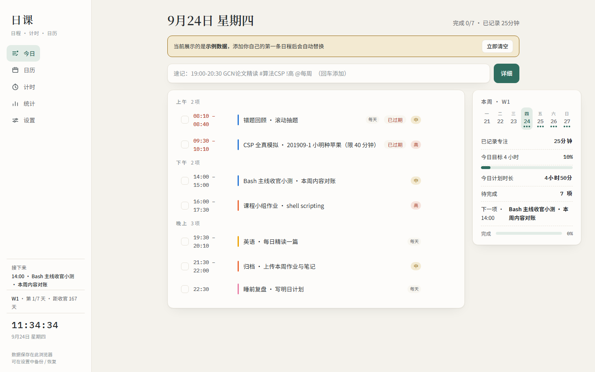

# 日课 · rike

单文件学习规划器——**日程 · 计时 · 日历 · 统计**，数据只存在你自己的浏览器里。

## 这是什么

一个用单个 HTML 文件写完的学习规划应用。不注册、不登录、不上传，
[在线打开](https://dingking928151.github.io/rike/)或者把 `index.html` 下载到本地双击，
就开始用了。所有数据保存在浏览器 localStorage，换设备时用「设置 → 数据备份」导出 JSON 即可迁移。

## 功能

- **日程规划** —— 顶部一行速记（`19:00-20:30 GCN论文精读 #算法 !高 @每周`），或点「详细」编辑；
  支持每天 / 每周重复、高中低优先级、科目分类可增删改名（1–10 个，每个科目单独配色）
- **时间记录** —— 自由计时 + 番茄钟（25 / 40 / 50 分钟三档），暂停、续计、手动补记
- **日历** —— 月视图彩色点标记日程密度，点任意一天看当日清单与专注时长；
  触屏上左右滑动即可翻月，带惯性跟手，松手自动落位
- **统计** —— 本周每日时长柱状图、科目分布、连续打卡天数、完成率
- **学习提醒** —— 日程开始前弹页面内提醒（准点～提前 30 分钟可调），可选提示音、震动反馈与浏览器系统通知
- **学习计划引擎** —— 设一个「锚点」日期和周号范围，侧栏常驻显示 `W几 · 第几天 · 距收官 N 天`；
  里程碑每行一条 `日期 事项`，最近两条自动倒计时
- **像素小窝** —— 一只 32×32 手绘像素宠物（橘猫 / 柴犬 / 兔子 / 小鸡 / 青蛙 / 熊猫），
  专注时长就是它的饭粮：每专注 25 分钟得一颗，喂它、陪它玩；饿久了会蔫、会睡着，但永远不会死。
  它还会说话——摸摸、投喂、或者晾它一会儿，都会冒出不同心情的台词气泡。
  累计专注 2 小时孵化、20 小时长大；可换主体颜色，像素编辑器自绘形象，
  形象代码可导出给朋友导入
- **Markdown 互导** —— Obsidian 每日笔记「✅ Tasks」下的清单原样可导入；
  任意一天也能一键导出成同样的 MD 格式
- **明暗双主题** —— 跟随系统，浅色纸感 / 深色墨感
- **外观自定义** —— 纸色背景与强调色各有多档预设、支持任意取色；
  深色模式自动按所选颜色配出同色系暗色，不用手动调两遍

## 快速开始

- **在线用**：<https://dingking928151.github.io/rike/>
- **离线用**：下载 [`index.html`](index.html)，双击打开。字体走 Google Fonts，
  断网或无法访问时自动回退系统字体，功能不受影响

> 提醒依赖页面处于打开状态（浏览器通知可后台提醒）；数据按浏览器隔离，
> 清缓存前记得先备份。

## 数据说明

所有数据存在当前浏览器的 `localStorage`（键名 `rike-v1`），不上传任何服务器。
首次打开展示的是示例数据，添加第一条日程后自动替换，也可点「立即清空」。
换设备 / 换浏览器：旧页面「设置 → 数据备份 → 复制 JSON」→ 新页面粘贴导入。

## 开发说明

没有构建步骤、没有依赖、没有框架——一个 HTML 文件即全部源码（内联 CSS + 原生 JS）。
改完刷新就能看效果。欢迎提 Issue / PR。

## License

[MIT](LICENSE)
