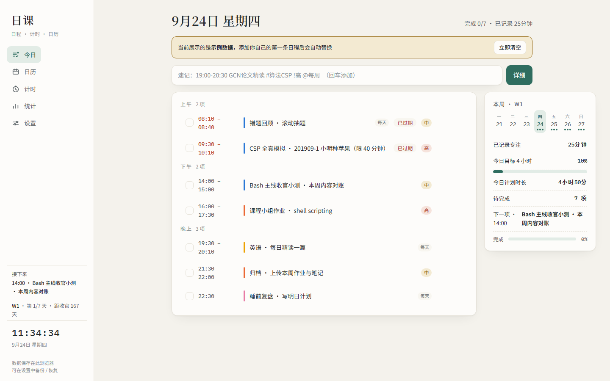

# 日课 · rike

单文件学习规划器——**日程 · 计时 · 日历 · 统计**，数据只存在你自己的浏览器里。



## 这是什么

一个用单个 HTML 文件写完的学习规划应用。不注册、不登录、不上传，
[在线打开](https://dingking928151.github.io/rike/)或者把 `index.html` 下载到本地双击，
就开始用了。所有数据保存在浏览器 localStorage，换设备时用「设置 → 数据备份」导出 JSON 即可迁移。

## 功能

- **日程规划** —— 顶部一行速记（`19:00-20:30 GCN论文精读 #算法 !高 @每周`），或点「详细」编辑；
  支持每天 / 每周重复、高中低优先级、科目分类可增删改名（1–10 个，每个科目单独配色）
- **时间记录** —— 自由计时 + 番茄钟（25 / 40 / 50 分钟三档），暂停、续计、手动补记
- **日历** —— 月视图彩色点标记日程密度，点任意一天看当日清单与专注时长；
  触屏上左右滑动即可翻月，带惯性跟手，松手自动落位
- **统计** —— 本周每日时长柱状图、科目分布、连续打卡天数、完成率
- **学习提醒** —— 日程开始前弹页面内提醒（准点～提前 30 分钟可调），可选提示音、震动反馈与浏览器系统通知
- **学习计划引擎** —— 设一个「锚点」日期和周号范围，侧栏常驻显示 `W几 · 第几天 · 距收官 N 天`；
  里程碑每行一条 `日期 事项`，最近两条自动倒计时
- **像素小窝** —— 一只 32×32 手绘像素宠物（橘猫 / 柴犬 / 兔子 / 小鸡 / 青蛙 / 抱竹子的熊猫），
  专注时长就是它的饭粮：每专注 25 分钟得一颗，喂它、陪它玩。它每天自己吃一颗存粮维持饱食，
  断粮挨饿攒满设定天数会退回上一阶段（最低变回蛋重新孵化，永远不会消失）；
  退化快慢在小窝里自己设置，也可以设为不退化。
  它还会说话——摸摸、投喂、或者晾它一会儿，都会冒出不同心情的台词气泡。
  它会呼吸起伏、摆尾抖耳、眨眼（设置里可关掉动效），脚下有软垫，
  累计专注 2 小时孵化、20 小时长大；可换主体颜色，像素编辑器自绘形象，
  形象代码可导出给朋友导入
- **PWA 可安装** —— 在线版可以「添加到主屏幕 / 安装」，手机上像原生 APP 一样全屏启动、
  有自己的图标（抱竹子的熊猫）与启动画面；装过之后断网也能打开，日程照常可查可勾
- **AI 智能体（MCP）** —— 自带零依赖本地桥 `agent/rike-mcp.js`，Claude Code、kimi 等
  PC 智能体挂上后能直接查今日日程与 7 天统计、用速记语法帮你加日程、补记专注时长、
  查看和投喂宠物；数据只走本机回环，不出电脑
- **手机 ↔ 电脑联动** —— 桥加 `--lan` 即开局域网 hub：手机浏览器打开打印的地址、
  输入 6 位配对码，手机和电脑从此用同一份数据，手机上加的日程电脑（和智能体）立刻可见
- **本地大模型管家** —— `agent/rike-llm.js` 把 Ollama / LM Studio 等本地模型接上
  同一套日课工具，断网也能在终端里对话管理日程
- **Markdown 互导** —— Obsidian 每日笔记「✅ Tasks」下的清单原样可导入；
  任意一天也能一键导出成同样的 MD 格式
- **中英双语** —— 设置里一键切换 简体中文 / English，全站界面、提示与日期格式即时翻译；
  速记语法两种语言都认（`!高/@每天` 与 `!high/@daily` 等价）
- **四种主题风格** —— 极简（默认）/ 像素（复古黄沙×紫罗兰调色盘、CRT 扫描线、
  3D 斜面按钮、小窝棋盘格地砖、阶跃动效）/ 墨纸（宣纸底、墨字、朱砂）/
  灵动（磨砂玻璃卡片、环境光渐变、胶囊控件、弹簧曲线动效），
  一键切换，明暗随系统自动适配
- **页面动效** —— 切换页面时卡片错峰上浮、主题切换平滑过渡；
  系统开启「减少动效」时自动降级为淡入
- **外观自定义** —— 纸色背景与强调色各有多档预设、支持任意取色；
  深色模式自动按所选颜色配出同色系暗色，不用手动调两遍

## 快速开始

- **在线用**：<https://dingking928151.github.io/rike/>
- **装成 APP**：
  - **iPhone / iPad**（Safari）：打开在线地址 → 分享 → 「添加到主屏幕」
  - **Android**（Chrome / Edge）：打开在线地址 → 菜单 → 「添加到主屏幕 / 安装应用」
  - **电脑**（Chrome / Edge）：地址栏右侧的安装图标，或菜单 → 「安装 日课」
- **离线用**：下载 [`index.html`](index.html)，双击打开。字体走 Google Fonts，
  断网或无法访问时自动回退系统字体，功能不受影响

> 提醒依赖页面处于打开状态（浏览器通知可后台提醒）；数据按浏览器隔离，
> 清缓存前记得先备份。

## 数据说明

所有数据存在当前浏览器的 `localStorage`（键名 `rike-v1`），不上传任何服务器。
首次打开展示的是示例数据，添加第一条日程后自动替换，也可点「立即清空」。
换设备 / 换浏览器：旧页面「设置 → 数据备份 → 复制 JSON」→ 新页面粘贴导入。

## AI 智能体（MCP）

想让 PC 上的 AI 智能体（Claude Code、kimi 等支持 MCP 的工具）直接读写日课？仓库里带了一个本地桥，零依赖，Node 16+ 即可：

```bash
# 1. 起桥（保持运行即可）
node agent/rike-mcp.js

# 2. 挂给 Claude Code；其他支持 MCP stdio 的智能体同理
claude mcp add rike -- node agent/rike-mcp.js
```

再在浏览器里打开日课页面（在线或本地双击都行），「设置 → AI 智能体」显示**已连接**就绪。之后直接对智能体说：

- 「看看我今天有什么安排」—— `rike_status` 汇报今日日程、专注时长、打卡天数、宠物状态
- 「帮我记 40 分钟专注」—— `rike_log_session` 补记时长，宠物照常得粮
- 「21:00 加一条复习线代 #数学」—— `rike_add_task` 走速记语法直接入日程
- 「宠物现在怎么样了 / 喂它一颗」—— `rike_pet`

工作方式：桥只监听 `127.0.0.1:7676`（端口可在设置里改），页面每 2.5 秒向它同步一次数据快照、领回待执行的操作；页面关掉或 15 秒没有心跳时，写操作会被明确拒绝。**数据不出本机**；从本 GitHub Pages 的 https 页面访问本地端口也已适配浏览器的专用网络访问（PNA）预检。

## 手机 ↔ 电脑联动（局域网 hub）

想在手机上用、又和电脑保持同一份数据？桥加一个 `--lan`：

```bash
node agent/rike-mcp.js --lan        # 想换端口: --lan-port 7777
```

控制台会打印手机浏览器要打开的地址（形如 `http://192.168.x.x:7777`）和 6 位配对码。
手机打开地址 → 输入配对码 → 完成，之后自动重连。连上后：

- 手机上加的日程、勾掉的待办，电脑上的日课页面约 5 秒内自动出现，反向同理
- PC 上的 AI 智能体也能看到手机上加的任务（hub 与 MCP 桥共享同一份数据）
- 手机上照样可以「添加到主屏幕」当 APP 用；联网用不了时数据也都在本机 localStorage 里

说明：

- 同步策略是**整库后写优先**（每次保存带时间戳，最后一次保存的完整数据胜出）——
  建议同一时间只在一台设备上改，避免互相覆盖
- 手机和电脑要在同一个 Wi-Fi / 局域网；Windows 防火墙第一次会弹窗，允许 Node.js
  在「专用网络」通过即可；hub 只在局域网内可达，数据不经过任何外部服务器

## 本地大模型当管家（OpenAI 兼容）

不想用云端 AI？手里有 Ollama / LM Studio 之类的本地模型服务，就能让本地模型管家里的日课：

```bash
# Ollama(默认地址)
node agent/rike-llm.js --base http://127.0.0.1:11434/v1 --model qwen3:8b

# LM Studio 换成 http://127.0.0.1:1234/v1
```

启动后终端里直接聊：「我今天有什么安排」「帮我记 40 分钟专注」「21:00 加一条复习线代 #数学」——
模型自己决定调哪个日课工具（就是上面 MCP 的那 5 个）。`/tools` 看工具列表，`/clear` 清上下文。

要求：node 18+；模型支持 function calling（Ollama 的 qwen3、llama3.1 等均可）。
写操作（加日程 / 补记 / 喂宠）需要日课页面开着——和 MCP 桥同一条规则。

## 开发说明

没有构建步骤、没有依赖、没有框架——一个 HTML 文件即全部源码（内联 CSS + 原生 JS）。
改完刷新就能看效果。欢迎提 Issue / PR。

## License

[MIT](LICENSE)
